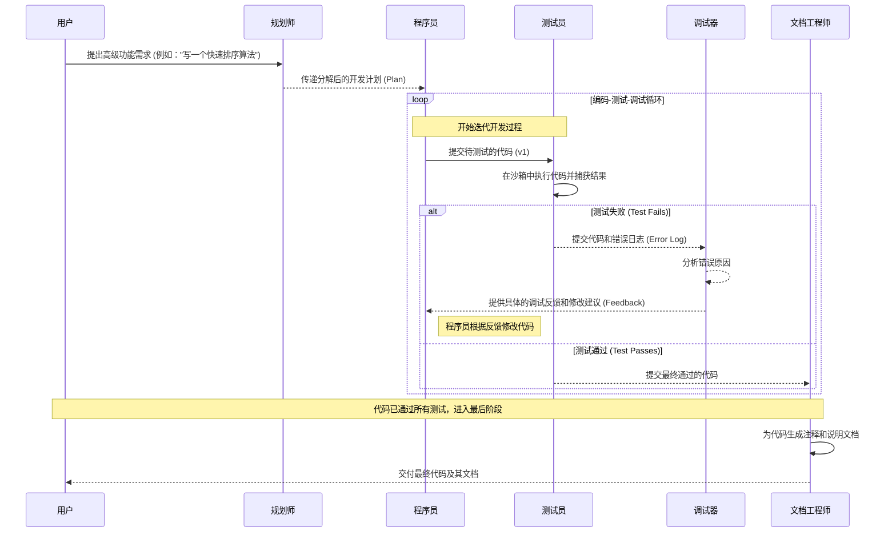

# 多智能体协作系统

基于 **LangChain** 和 **LangGraph** 架构的多智能体协作自动化软件开发工作流。使用 **Google Gemini** 模型驱动，通过为 Agent 分配代码生成、单元测试编写及代码审查等不同角色，并为其配备文件系统读写、代码执行等工具，成功构建了能够端到端自动化完成简单功能模块开发与测试的原型系统。

## 🌟 特性

- **多智能体协作**: 包含规划师、程序员、测试员、调试器、文档工程师等专业角色
- **LangGraph驱动**: 使用LangGraph构建复杂的条件分支工作流
- **Gemini模型**: 基于Google Gemini Pro模型，提供强大的代码生成能力
- **自动化工作流**: 从需求分析到代码生成、测试、调试、文档生成的完整流程
- **智能迭代**: 支持测试失败后的自动调试和代码修复
- **工具集成**: 提供文件操作、代码执行、分析等完整工具链
- **可扩展架构**: 基于 LangChain 和 LangGraph 的模块化设计

## 🏗️ 架构设计

### 智能体角色

1. **📋 规划师 (PlannerAgent)**: 分析用户需求并制定详细开发计划
2. **👨‍💻 程序员 (CoderAgent)**: 根据需求和计划生成高质量代码
3. **🧪 测试员 (TesterAgent)**: 编写单元测试并执行代码验证
4. **🔧 调试器 (DebuggerAgent)**: 分析测试失败原因并修复代码
5. **📚 文档工程师 (DocumenterAgent)**: 生成代码文档和使用说明

### 工作流程



## 🚀 快速开始

### 安装

```bash
# 克隆项目
git clone https://github.com/your-repo/langchain-multi-agent-workflow.git
cd langchain-multi-agent-workflow

# 安装依赖
pip install -r requirements.txt

# 或者使用 pip 直接安装
pip install -e .
```

### 配置环境变量

```bash
# 复制环境变量示例文件
cp .env.example .env

# 编辑 .env 文件，填入您的 Google API 密钥
GOOGLE_API_KEY=your_google_api_key_here
```

**获取Google API密钥**：
1. 访问 [Google AI Studio](https://ai.google.dev/)
2. 创建新项目或选择现有项目
3. 生成API密钥
4. 将密钥添加到 `.env` 文件中

### 基本使用

```python
import asyncio
from src.main import MultiAgentWorkflow

async def main():
    # 创建工作流实例
    workflow = MultiAgentWorkflow()
    
    # 执行工作流
    result = await workflow.execute_workflow(
        "实现一个快速排序算法，支持升序和降序排序"
    )
    
    # 查看结果
    print(f"执行成功: {result['success']}")
    print(f"生成的代码: {result['final_code']}")
    print(f"文档: {result['final_documentation']}")

if __name__ == "__main__":
    asyncio.run(main())
```

## 📁 项目结构

```
langchain-multi-agent-workflow/
├── src/
│   ├── __init__.py
│   ├── main.py                 # 主应用入口
│   ├── config.py               # 配置管理
│   ├── agents/                 # 智能体模块
│   │   ├── __init__.py
│   │   ├── base_agent.py       # 基础智能体类
│   │   ├── planner_agent.py    # 规划师智能体
│   │   ├── coder_agent.py      # 程序员智能体
│   │   ├── tester_agent.py     # 测试员智能体
│   │   ├── debugger_agent.py   # 调试器智能体
│   │   └── documenter_agent.py # 文档工程师智能体
│   ├── tools/                  # 工具模块
│   │   ├── __init__.py
│   │   ├── file_tools.py       # 文件操作工具
│   │   ├── code_execution_tools.py # 代码执行工具
│   │   └── analysis_tools.py   # 代码分析工具
│   └── workflow/               # 工作流模块
│       ├── __init__.py
│       ├── workflow_state.py   # 工作流状态管理
│       ├── workflow_nodes.py   # 工作流节点定义
│       └── workflow_graph.py   # 工作流图定义
├── examples/
│   └── basic_usage.py          # 使用示例
├── tests/
│   └── test_agents.py          # 测试用例
├── requirements.txt            # 依赖列表
├── pyproject.toml             # 项目配置
├── .env.example               # 环境变量示例
├── .gitignore                 # Git 忽略文件
└── README.md                  # 项目说明
```

## 🔧 配置选项

### 环境变量

- `GOOGLE_API_KEY`: Google API 密钥（必需）
- `LLM_MODEL`: 使用的语言模型（默认: gemini-pro）
- `TEMPERATURE`: 模型温度（默认: 0.7）
- `MAX_TOKENS`: 最大令牌数（默认: 2000）
- `MAX_ITERATIONS`: 最大迭代次数（默认: 3）

### 程序配置

```python
from src.config import Config

# 创建自定义配置
config = Config(
    llm_model="gemini-pro",
    temperature=0.5,
    max_iterations=5,
    timeout=60
)

# 使用自定义配置
workflow = MultiAgentWorkflow(config)
```

## 📊 使用示例

### 示例 1: 快速排序算法

```python
result = await workflow.execute_workflow("""
实现一个快速排序算法，要求：
1. 支持升序和降序排序
2. 包含完整的错误处理
3. 性能优化，避免最坏情况
4. 添加详细的文档说明
""")
```

### 示例 2: 网络爬虫

```python
result = await workflow.execute_workflow("""
实现一个简单的网络爬虫，要求：
1. 使用 requests 库获取网页内容
2. 使用 BeautifulSoup 解析 HTML
3. 支持处理常见的异常情况
4. 包含延迟控制避免过于频繁请求
""")
```

### 示例 3: 数据处理工具

```python
result = await workflow.execute_workflow("""
实现一个 CSV 数据处理工具，要求：
1. 读取 CSV 文件
2. 支持数据清洗（去重、处理缺失值）
3. 支持基本的数据统计分析
4. 支持数据导出
""")
```

### 快速测试

```bash
# 运行测试工作流
python test_workflow.py

# 运行基本示例
python examples/basic_usage.py
```

## 📈 性能指标

- **平均执行时间**: 2-5 分钟（取决于任务复杂度）
- **代码质量**: 支持 PEP 8 规范检查
- **测试覆盖率**: 目标 >80%
- **迭代成功率**: 通常 2-3 次迭代即可收敛

## 🛠️ 开发

### 开发环境设置

```bash
# 安装开发依赖
pip install -e ".[dev]"

# 代码格式化
black src/ tests/

# 代码检查
flake8 src/ tests/

# 类型检查
mypy src/
```

### 贡献指南

1. Fork 项目
2. 创建功能分支 (`git checkout -b feature/amazing-feature`)
3. 提交更改 (`git commit -m 'Add amazing feature'`)
4. 推送到分支 (`git push origin feature/amazing-feature`)
5. 创建 Pull Request

## 📄 许可证

本项目采用 MIT 许可证 - 查看 [LICENSE](LICENSE) 文件了解详情。

## 🤝 贡献者

- **Multi-Agent Team** - *初始工作* - [GitHub](https://github.com/your-username)

## 📞 联系方式

- 项目主页: [https://github.com/your-repo/langchain-multi-agent-workflow](https://github.com/your-repo/langchain-multi-agent-workflow)
- 问题报告: [Issues](https://github.com/your-repo/langchain-multi-agent-workflow/issues)
- 电子邮件: team@example.com

## 🙏 致谢

- [LangChain](https://github.com/langchain-ai/langchain) - 为 LLM 应用提供的强大框架
- [LangGraph](https://github.com/langchain-ai/langgraph) - 构建有状态的多智能体应用
- [OpenAI](https://openai.com/) - 提供强大的语言模型 API

---

⭐ 如果这个项目对您有帮助，请给我们一个 Star！